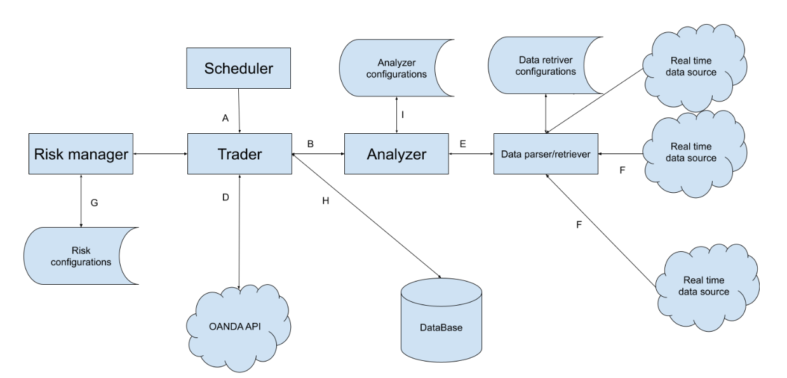

needs https://github.com/lucas-campagna/mt5linux?tab=readme-ov-file

This project intends to make an automated CFD trading system. As long as we have APIs to bind, we can make the code
working. Currently, I have developed it for MetaTrader and Oanda. 

So, here is the architecture of the project:

1. Scheduler: 
Using Celery, python scheduler module or something else, triggers trade signals in intervals.
API endpoint: trigger containing demo/real signal. The scheduler is supposed to be the main
service
2. Trader: 
It controls everything. Makes a trade object, fills the gaps of that trade with api calls from
analyzer and risk manager and OANDA API, gets the credentials from database, sends it to
OANDA, then creates its entity in the database and later tracks the results of that trade and
updates the entity in the database.
3. Risk Manager: 
This module is the one that will set the take profit and stop loss levels. Trader will send a
request to it, asking for the level with a certain payload (including the market price as well as
other stuff that will be defined by domain experts). The risk manager will take the payload,
analyse it and responses with the sl, tp levels. For public repository, the levels will be a certain
degree below or above the current market price. The actual module will be kept as a trade
secret.
4. Analyzer: 
Trader sends a request to the analyser asking for the market situation for a particular pair (or
stock or anything else). The analyzer takes the data related to that pair, computes what it needs
and then returns back the market situation by categorical data [‘bull’, ‘bear’, ’lateral’] to the
trader.
5. Data parser/retriever: 
The data parser or retriever is a crucial part, heavy to implement. It will get the data from
designated sources, according to the configurations. Hopefully all the data are available on API
resources. Otherwise crawlers should be developed which is tedious work. These retriever
classes will get the data, encapsulate them and return them back to the analyzer as a response.

ports:
* analyzer: 5003
* scheduler: 5002
* risk_manager: 5001
* trader: 5000 (no dockerfile)